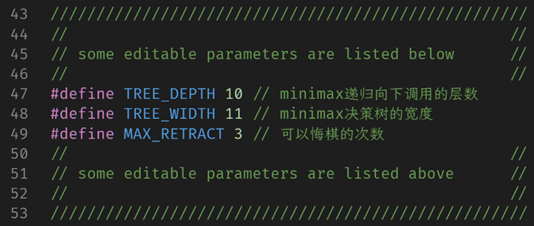
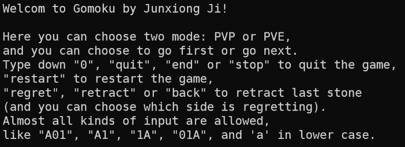
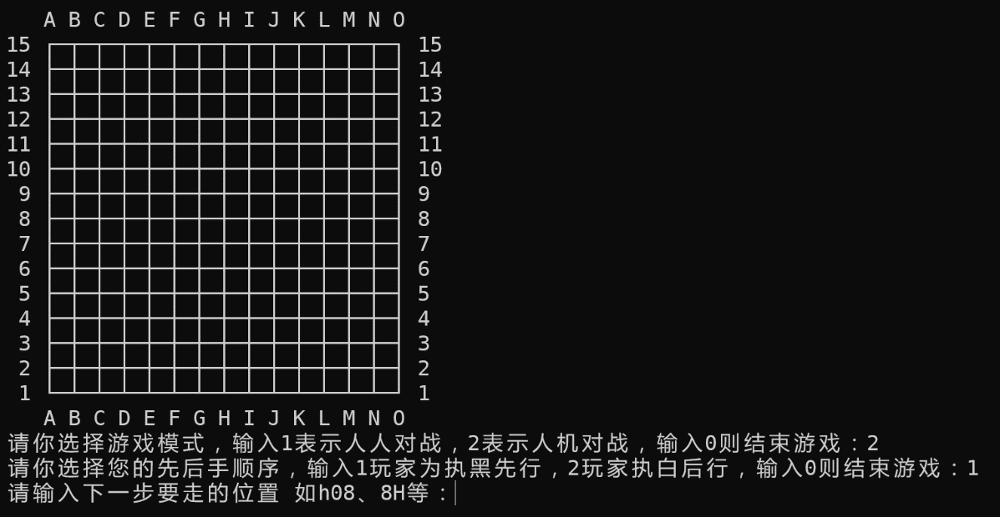
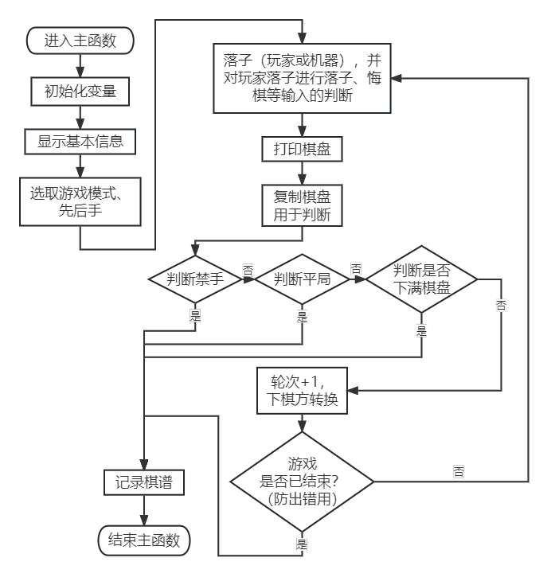
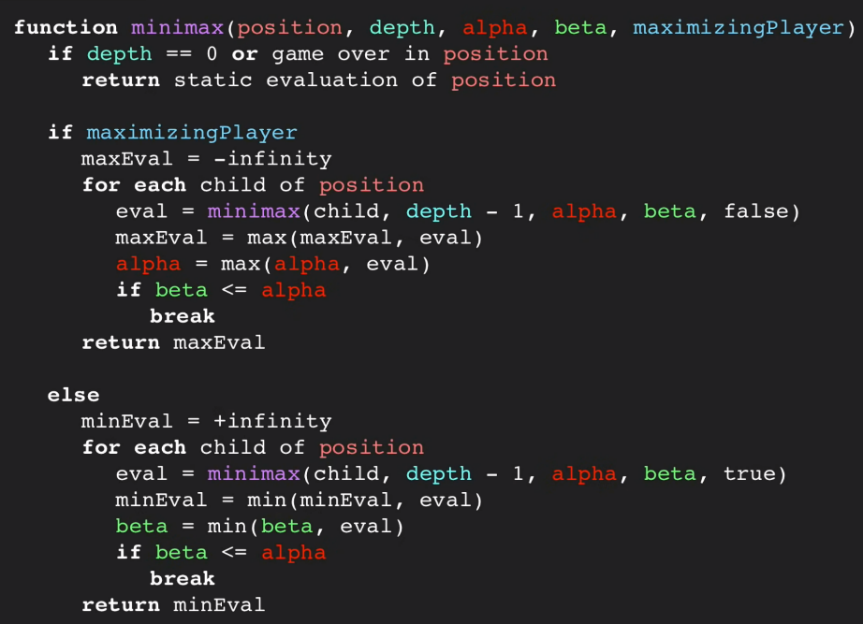
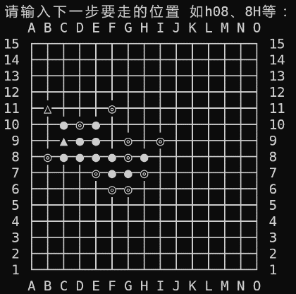
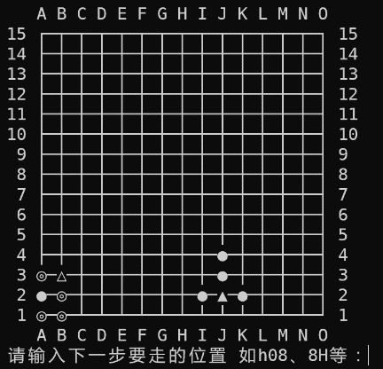
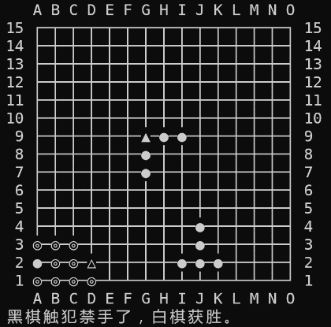
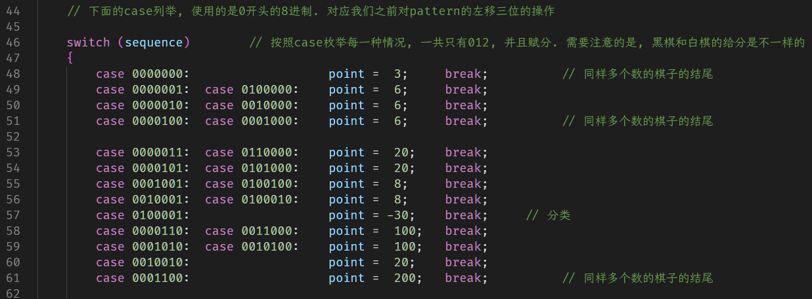
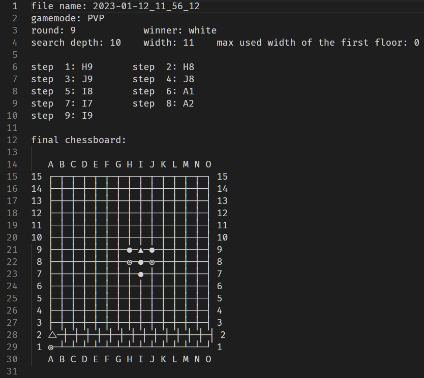

# 五子棋程序说明文档

## 简介

本文件是国科大21级本科生编写的五子棋程序，是程序设计基础与实验（C语言）课程的大作业。该程序能够基本遵守基础的禁手规则，提供了人人对战、人机对战两种功能，并能判断玩家下出的禁手、记录对战的棋谱。程序提供悔棋功能，选手可以在头文件中选择需要悔棋的步数并更改。机器落子由使用 alpha-beta 剪枝的 minimax 搜索实现，打分采用全局打分与赢棋、禁手判断打分相结合的方法，同样在头文件中提供对决策树深度、宽度的限制。程序提供两种棋盘，分别针对窄、宽字符设计，可以在编译时用命令行参数调整，默认为前者。程序使用 UTF-8 编码，建议在 Linux 环境中编译运行。

## 使用说明

### 程序相关配置

该程序由数个.c源代码文件与一个.h头文件组成，另需要一个名为`game_records`的文件夹存放棋谱（可选，不会自动创立）。
使用程序前，将所有程序以及棋谱文件夹放置在同一目录下。

### 程序使用

使用1:2的窄字符:

```bash
gcc -o gomoku_-O2_narrow *.c -O2
./gomoku_-O2_narrow
```

使用1:1的宽字符:

```bash
gcc -o gomoku_-O2_wide *.c -O2 -D_WIDE
./gomoku_-O2_wide
```

推荐使用`-O2`编译选项以提高计算速度。编译时会对`system("clear");`命令给出警告，无视即可。

可以在头文件`gomoku.h`中自主调节搜索的深度和宽度限制，也可以更改可悔棋次数。如图所示。



进入程序后，选择游戏模式。若选择人机对战，则需要选择游戏模式。若选择人机对战模式，则需继续选择玩家一方为黑棋（先手）还是白棋（后手）。





之后玩家根据提示信息不断选择落子位置即可。

在游戏正常结束后，若检测到编译文件所在目录下，有`game_records`文件夹的存在，则向其中自动存储棋谱。若无需记录棋谱，可在编译时添加选项`-D_NORECORD`。

## 程序介绍

### 总体运行流程



### 玩家落子判断

调用`place_stone()`函数实现。读取一行字符，针对读取到里面有`end`, `quit`等字符的，予以相应的操作。否则，判断是否为有效落子输入，根据不同格式用多条 if 语句判断输入为哪一个坐标，并且判断是否在棋盘内、是否已被落子。如果是有效落子，就调用`record_position()`函数，实现落子的记录，最终结束程序。

### 机器落子判断

调用`computer_placing()`函数实现。首先对比开局定式，观察是否可以直接计算出固定开局的最优结果。然后赋值一个棋盘、六元组、打分（后两者将在打分函数中介绍），用于之后的使用（为了保护落子用的棋盘）。初始化决策树的根节点，然后调用`minimax()`函数，开始 minimax 搜索，返回最大的分值，再在树的子节点中找到相同的分值并选择落子。如果有落子，调用`record_position()`函数，实现落子的记录，最终结束程序。

### 使用 alpha-beta 剪枝的 minimax 搜索

调用`minimax()`函数实现。方法是进入函数后在复制棋盘中落子，调用`create_first_floor()`和`create_new_floor()`建立下一层决策树。若下一层决策树为空，则返回本身打分作为函数返回值；若不为空，则进行 alpha-beta 剪枝的 minimax 算法的递归部分，选取下一层中最大（本层为白棋，下一层的黑棋肯定会选最高分）或最小（本层为黑棋，下一层的白棋肯定会选最低分）的打分，并剪掉（实际操作为不将递归进行下去）多余的决策树。算法伪代码如下：



### 禁手判断

调用`judge_legal()`函数实现。将落子位置上、下、左、右、左上、右上、左下、右下八个方向的几个参数记录：相邻的同色棋子个数、同色棋子向外空缺数、第一次空缺一格后，再向外相连的同色棋子个数、结尾处为什么颜色的棋子。之后用这些输入去判断是否存在长连、赢棋、四、活三。判断四使用`judge_4()`函数，将参数输入后自动可以得出各种不同类型的四，包括没有四、冲四、活四，以及两个活四连在同一行形成的“扁担四”形状。判断活三使用`judge_3()`函数，用递归方法去判断一个看起来像活三的东西，落新子后是否为能够成为不是禁手的活四。如果本步有禁手，可以如此判断出来。
经过测试，在距离边界较远的情况下，程序基本可以判断出来中央部分递归的禁手。但是比赛中，在靠近边界时出现了禁手，程序并未指出。下三图为分别为实际比赛棋谱和两个测试状况。







### 打分

调用`evaluation()`函数实现。相连六个格点（共四种倾斜方向全部包括）的棋子颜色（黑色、白色、空位）形成的一组模式，我们称为一个六元组，并且给每一种六元组一个打分，有利于黑棋则为正，否则为负。随着棋局的进行，每次进行落子我们把所有的六元组的变化，以及对应六元组的打分的变化，记录在对应的棋盘当中（因此使用了两个函数，一个`place_stone()`改变实际棋盘，一个`place_stone_on_copy()`改变副本棋盘）。为了方便给出打分，我们在调用打分函数`时，将模式通过左移符号转化为每一位只能是 0/1/2 的八进制数，0/1/2 分别代表棋盘格点上的空位、黑子和白子



### 建立决策树

调用`create_first_floor()`和`create_new_floor()`函数实现。通过树结构实现。如果需要建立子结点的母结点每一层按照黑-白（或者白-黑，如果落子为白子）打分差排序，排序打分差，选取分数最高（最低）的`TREE_WIDTH`个结点录入为子结点。考虑满足以下要求的所有交叉点：这个位置在棋盘内部；这个点上并没有落子；这个点周围八个方向邻接或隔着一格的点有落子（且在棋盘内）。如果搜索深度到底了，就不建立下一层的结点了。使用了链表辅助生成可选的结点之集合，以避免大量重复计算。

### 棋谱记录

调用`final_recording()`函数实现。输出时间到字符串，记录成“年-月-日_时_分_秒”的格式，并加上`.txt`后缀作为文件名、加上`./game_records/`前缀作为路径，记录在这个文件夹当中。如果没有文件夹则不记录。棋谱记录格式如下图所示。由于规定符号原因，三角白子无法对齐，造成显示不美观的问题。（本想用其他棋子符号，但为大作业需要使之一致）



### 悔棋

调用retract_stone()函数实现。只需要将之前存储的部分棋子取出，在根据悔棋方为谁决定撤回哪些子即可。撤回单子可调用retract_black()和retract_white()函数实现。

### 树与链表的操作

具体操作很简单，本程序仅将可能需要用到的操作（如新增结点、复制整条链表等）写入程序中。
